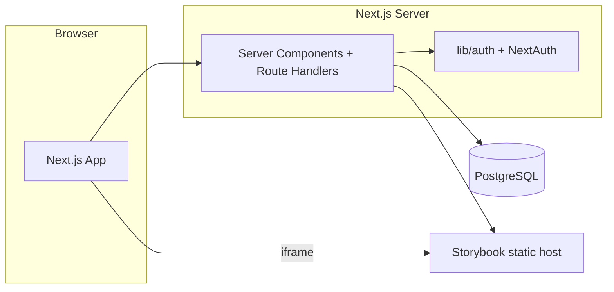

# Storyground — アーキテクチャ

## 目的と境界

Storyground は **BFF 兼 Web UI** として、認証付きのプロジェクト / ストーリー / コメント / フロー CRUD を担い、Storybook 本体のホスティングは担いません。クライアントは Next.js、永続層は PostgreSQL（Prisma）です。

- **直接ブラウザ → Storybook**: ストーリー iframe の表示（`Story.url`）。
- **Next サーバ → Storybook**: 一覧取得のみ（`GET /api/proxy-storybook` 経由の JSON）。認証必須の Storybook には向かない。

## ディレクトリの役割（抜粋）

| 領域                   | 主な場所                                                                | 役割                                                                                                |
| ---------------------- | ----------------------------------------------------------------------- | --------------------------------------------------------------------------------------------------- |
| 認証                   | `lib/auth.ts`, `app/api/auth/[...nextauth]/`                            | Google OAuth、または `AUTH_DEBUG` 時の固定デバッグセッション。Prisma 上に debug ユーザーを upsert。 |
| DB アクセス            | `lib/prisma.ts`                                                         | `pg` プール + `PrismaPg` アダプタで `PrismaClient` を生成（開発時シングルトン）。                   |
| アプリシェル           | `app/(app)/layout.tsx`                                                  | 未ログインは `/login` へ。ヘッダーにユーザーと DEBUG 表示。                                         |
| プロジェクト / 同期 UI | `app/(app)/projects/**`, `components/stories/StorySyncButton.tsx`       | プロジェクト CRUD 画面、Storybook からの一括 sync。                                                 |
| ストーリービューア     | `components/viewer/*`, `hooks/useThreads.ts`                            | iframe + 座標正規化オーバーレイ、スレッド API とのクライアント整合。                                |
| コメント               | `components/comments/*`                                                 | スレッド / コメントの作成・更新。                                                                   |
| フロー                 | `components/flows/*`, `app/api/flows/*`, `app/api/projects/.../flows/*` | React Flow によるノード / エッジ編集、PUT で一括永続化。                                            |
| デモ用                 | `storybook-demo/`                                                       | 本番アプリとは別樹の CRA + Storybook サンプル（参照用）。                                           |

## ルーティング

- `app/page.tsx` → `redirect("/projects")`
- `app/(auth)/login` — サインイン（NextAuth ページ設定）
- `app/(app)/*` — ログイン必須（レイアウトで `auth()` を検証）
- `app/api/*` — JSON API と NextAuth ハンドラ

## 認可モデル

- **Project** は `ownerId`（User）所有。
- ストーリー・スレッド・フローはプロジェクト配下。API ルートは `auth()` で `session.user.id` を取得し、**プロジェクトの owner と一致**する条件で `findFirst` / `update` します（フローは `project: { ownerId }` で紐づく）。

## 主要データフロー

### ストーリー同期

1. クライアントが `StorySyncButton` から `GET /api/proxy-storybook?url=.../index.json`（失敗時は `stories.json`）を呼ぶ。サーバが URL を `fetch` し JSON を返す。
2. 各エントリに対し `POST /api/projects/{id}/stories` で `storyId` / `title` / `url`（iframe 用）を upsert。

### コメント

- スレッド: `x`, `y` はビューア上の **0–1 正規化座標**（`StoryViewer` のオーバーレイ `getBoundingClientRect` 基準）。
- クライアントは `useThreads` 等で `GET/POST/PATCH` … の API 群（`app/api/threads/`, `app/api/stories/.../threads` 等）を利用。詳細はルート定義に従う。

### フロー永続化

- `FlowEditor` は React Flow の `nodes` / `edges` を保持し、保存時に `PUT /api/flows/{id}` へ `FlowNodeInput` / `FlowEdgeInput` を送る。サーバ側で既存ノード / エッジの差分置き換え（実装に準拠）。

## データモデル（Prisma 要約）

- **User** — NextAuth + PrismaAdapter 標準＋ `Project` / `CommentThread` / `Comment` リレーション。
- **Project** — `name`, `storybookUrl`（トップ URL）。
- **Story** — `storyId`（Storybook の id）、`title`, プレビュー用 `url`。プロジェクト内で `(projectId, storyId)` 一意。
- **CommentThread** — `storyId`、正規化 `(x, y)`、`open` / `resolved`。
- **Comment** — `threadId`, `body`。
- **Flow** — プロジェクト内 `name` 一意。`description` 任意。
- **FlowNode** — 所属 `flowId`、参照 `storyId`、レイアウト用 `x,y,width,height`。
- **FlowEdge** — `fromNodeId` / `toNodeId`、optional `sourceHandle` / `targetHandle`、ラベル。
- **Hotspot** — 将来の遷移矩形（`fromStoryId` / `toStoryId` / `rect`）。現 UI からは未接続の可能性が高い。

## API の構造（概念）

- **リソース** — `/api/projects`, `/api/projects/[id]/stories`, `/api/stories/[id]/threads`, `/api/threads/[id]`, `/api/threads/[id]/comments`, `/api/flows/[id]`, `/api/projects/[id]/flows`, `/api/hotspots`, `/api/proxy-storybook`。
- **パターン** — Route Handler で `auth()` チェック、Prisma で検証可能な `where`、JSON `Response.json`。

## クライアント補足

- **iframe + オーバーレイ** — 配置モードのときだけオーバーレイが `pointerEvents` を有効化し、Storybook への直接クリックと競合しないようにしている。
- **React Flow** — `nodeTypes.story` でカスタム `StoryNode`。CSS は `reactflow/dist/style.css` を import。

## 拡張時のフック

- Storybook 認証: 同期・proxy をサーバ側の資格情報付き `fetch` に寄せる、または Storyground 専用の published URL を用意する。
- 埋め込み制限: Storybook 側のヘッダー、または reverse proxy の調整。
